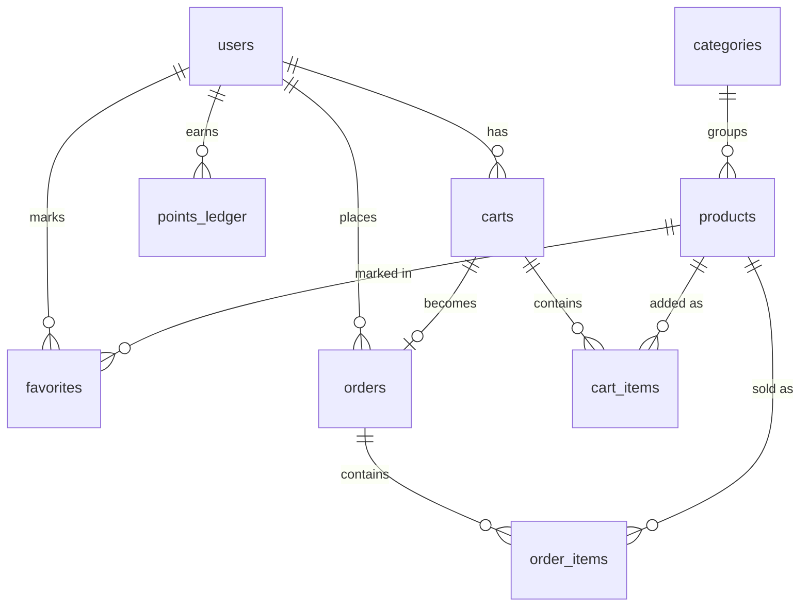

# 01 — Modelo de datos

> Depende de: `00-overview.md`. Commit asociado: `feat(db): schema and seed for users, categories, products`.

## 1. Objetivo

Definir las tablas, relaciones, restricciones e índices de SQLite, y el contenido del seed. El esquema debe hacer imposibles por diseño los estados inválidos (puntos duplicados, dos carritos abiertos, stock negativo).

## 2. Convenciones

- Motor: SQLite vía `better-sqlite3`, con `PRAGMA foreign_keys = ON` en cada conexión.
- Claves primarias: `INTEGER PRIMARY KEY AUTOINCREMENT`, salvo claves compuestas indicadas.
- Dinero: enteros en **pesos colombianos (COP)**, sin decimales.
- Nombres de tablas y columnas en `snake_case` y en inglés.
- El esquema vive en `backend/src/db/schema.sql` y se aplica al iniciar si las tablas no existen. No hay sistema de migraciones (recorte documentado).
- Ruta de la base de datos configurable con `DATABASE_PATH` (por defecto `./data/app.db`). Las pruebas usan `:memory:`.

### Fechas

Todo `created_at` es **texto ISO 8601 en UTC**, con milisegundos y `Z`: `2026-10-04T18:01:14.104Z`. Como el orden lexicográfico de ese formato coincide con el orden cronológico, `ORDER BY created_at` no necesita conversiones.

El default es `strftime('%Y-%m-%dT%H:%M:%fZ', 'now')` y **no** `CURRENT_TIMESTAMP`. No es equivalente: `CURRENT_TIMESTAMP` escribe `2026-10-04 18:01:14`, sin `T`, sin milisegundos y sin zona, y `new Date()` interpreta ese texto como **hora local**. En una máquina en UTC-5, una fila escrita a las 18:01 se leía como las 13:01. El desfase dependía de dónde se ejecutara el servidor.

> Sin migraciones (sección 8), cambiar el default no reescribe filas ya existentes: una base creada antes del cambio queda con ambos formatos mezclados hasta que se regenere. La base de desarrollo se reconstruye borrándola y corriendo `npm run seed`, que es la vía documentada para obtener una base consistente.

### Texto buscable

La búsqueda por nombre (sección 5) no compara la columna cruda sino el texto normalizado con `normalize_text()`, una función registrada en cada conexión que pasa a minúsculas y quita tildes (NFD, quitando los diacríticos). Así `"Jamón Rástico"` coincide con una búsqueda de `jamon`.

`normalize_text()` va como función registrada y no dentro del `WHERE` de cada consulta porque el orden de evaluación de los predicados en SQLite no está garantizado: escrito en línea, `normalize_text(name) LIKE ?` puede ejecutarse en el orden que quiera. Dentro de una función registrada el motor resuelve el índice antes de invocarla, así que el orden deja de importar. Se declara `deterministic` para que SQLite la permita en índices y en planes con `LIKE`/`GLOB`.


## 3. Diagrama



## 4. Tablas

### users

| Columna | Tipo | Restricciones |
|---|---|---|
| id | INTEGER | PK |
| email | TEXT | NOT NULL, UNIQUE, `COLLATE NOCASE` |
| password_hash | TEXT | NOT NULL (bcrypt) |
| name | TEXT | NOT NULL |
| points_balance | INTEGER | NOT NULL, DEFAULT 0, `CHECK (points_balance >= 0)` |
| created_at | TEXT | NOT NULL |

### categories

| Columna | Tipo | Restricciones |
|---|---|---|
| id | INTEGER | PK |
| name | TEXT | NOT NULL, UNIQUE |
| slug | TEXT | NOT NULL, UNIQUE (ej. `hogar`, `accesorios`) |

### products

| Columna | Tipo | Restricciones |
|---|---|---|
| id | INTEGER | PK |
| name | TEXT | NOT NULL |
| price | INTEGER | NOT NULL, `CHECK (price > 0)` |
| category_id | INTEGER | NOT NULL, FK → categories(id) |
| image_url | TEXT | NOT NULL |
| stock | INTEGER | NOT NULL, `CHECK (stock >= 0)` |
| created_at | TEXT | NOT NULL |

Índices:
- `idx_products_category` sobre `category_id`.
- `idx_products_name` sobre `name COLLATE NOCASE`.

> La búsqueda por nombre usa `LIKE '%q%'` sobre `normalize_text(name)` (ver sección 2, "Texto buscable"), por lo que no aprovecha el índice: con un catálogo de ~40 productos es irrelevante. El índice de nombre sirve para el ordenamiento alfabético, que es lo que lo justifica. La mejora (FTS5) queda para una segunda iteración.

### carts

| Columna | Tipo | Restricciones |
|---|---|---|
| id | INTEGER | PK |
| user_id | INTEGER | NOT NULL, FK → users(id) |
| status | TEXT | NOT NULL, DEFAULT `'open'`, `CHECK (status IN ('open','checked_out'))` |
| created_at | TEXT | NOT NULL |

Índice único parcial: un solo carrito abierto por usuario.

```sql
CREATE UNIQUE INDEX one_open_cart_per_user ON carts(user_id) WHERE status = 'open';
```

### cart_items

| Columna | Tipo | Restricciones |
|---|---|---|
| id | INTEGER | PK |
| cart_id | INTEGER | NOT NULL, FK → carts(id) ON DELETE CASCADE |
| product_id | INTEGER | NOT NULL, FK → products(id) |
| quantity | INTEGER | NOT NULL, `CHECK (quantity > 0)` |

Restricción: `UNIQUE (cart_id, product_id)`.

Índice: `idx_cart_items_cart` sobre `cart_id`, que es el acceso de `GET /api/cart` (cargar el carrito entero).

### favorites

| Columna | Tipo | Restricciones |
|---|---|---|
| user_id | INTEGER | NOT NULL, FK → users(id) |
| product_id | INTEGER | NOT NULL, FK → products(id) |
| created_at | TEXT | NOT NULL |

Clave primaria compuesta: `(user_id, product_id)`.

### orders

| Columna | Tipo | Restricciones |
|---|---|---|
| id | INTEGER | PK |
| user_id | INTEGER | NOT NULL, FK → users(id) |
| cart_id | INTEGER | NOT NULL, UNIQUE, FK → carts(id) |
| total | INTEGER | NOT NULL, `CHECK (total > 0)` |
| created_at | TEXT | NOT NULL |

`cart_id` único: un carrito solo puede convertirse en una orden, lo que vuelve el checkout idempotente.

Índice: `idx_orders_user` sobre `user_id`, que es el acceso del historial de pedidos.

### order_items

| Columna | Tipo | Restricciones |
|---|---|---|
| order_id | INTEGER | NOT NULL, FK → orders(id) |
| product_id | INTEGER | NOT NULL, FK → products(id) |
| quantity | INTEGER | NOT NULL, `CHECK (quantity > 0)` |
| unit_price | INTEGER | NOT NULL (precio al momento de la compra) |

Clave primaria compuesta: `(order_id, product_id)`.

### points_ledger

| Columna | Tipo | Restricciones |
|---|---|---|
| id | INTEGER | PK |
| user_id | INTEGER | NOT NULL, FK → users(id) |
| action | TEXT | NOT NULL, `CHECK (action IN ('FAVORITE','PURCHASE'))` |
| reference | TEXT | NOT NULL (id de producto para `FAVORITE`, id de orden para `PURCHASE`) |
| points | INTEGER | NOT NULL, `CHECK (points > 0)` |
| created_at | TEXT | NOT NULL |

Restricción: `UNIQUE (user_id, action, reference)`. Es el mecanismo anti-abuso: la base de datos rechaza cualquier premio repetido. Reglas de puntos en `03-rewards.md`.

Índice: `idx_points_ledger_user` sobre `user_id`, que es el acceso del invariante 1 (sumar el ledger de un usuario) y de la verificación de saldo de `GET /api/me`.

## 5. Invariantes

1. `users.points_balance` es igual a la suma de `points_ledger.points` del usuario. Ambos se modifican siempre en la misma transacción.
2. Un usuario tiene como máximo un carrito `open`.
3. `products.stock` nunca es negativo. El descuento se hace con `UPDATE ... SET stock = stock - ? WHERE id = ? AND stock >= ?` dentro de la transacción de checkout, verificando que se afectó una fila.
4. Ninguna fila de `order_items` cambia después de creada; el precio vigente del producto no altera órdenes pasadas.
5. Quitar un favorito o un producto del carrito nunca elimina filas de `points_ledger`.

## 6. Seed

Comando: `npm run seed` (en `backend/`). Debe ser **idempotente**: se puede ejecutar varias veces sin duplicar datos.

| Entidad | Cantidad | Detalle |
|---|---|---|
| categories | 4 a 5 | Nombres en español, con `slug` |
| products | ~40 | Datos tomados de DummyJSON, traducidos al español, precios en COP redondeados a miles, imágenes por URL |
| users | 2 | Credenciales de prueba documentadas en el README; contraseñas hasheadas con bcrypt al sembrar |

Fuente de datos: `backend/src/db/seed-data/products.json`, versionado en el repo. El seed no hace llamadas de red.

## 7. Criterios de aceptación

- [x] `schema.sql` crea todas las tablas, claves foráneas e índices descritos.
- [x] `npm run seed` deja 4 a 5 categorías, ~40 productos y 2 usuarios, y puede repetirse sin errores ni duplicados.
- [x] Insertar dos carritos `open` para el mismo usuario falla por restricción de la base de datos.
- [x] Insertar dos filas de `points_ledger` con el mismo (user, action, reference) falla por restricción.
- [x] No se puede guardar stock negativo, cantidades en cero ni precios no positivos.
- [x] Con `foreign_keys = ON`, no se puede crear un producto con una categoría inexistente.
- [x] Las pruebas pueden crear una base de datos en memoria con el mismo esquema.
- [x] `created_at` sale en ISO 8601 con `Z`, y `new Date(created_at).toISOString()` devuelve el mismo texto que había guardado.
- [x] `ORDER BY created_at` ordena igual que por instante.
- [x] `normalize_text()` está disponible en toda conexión abierta por `openDatabase()`, y encuentra un producto escrito con tildes al buscar sin tildes.

## 8. Fuera de alcance

- Sistema de migraciones.
- Búsqueda de texto completo (FTS5).
- Borrado lógico (soft delete), auditoría de cambios.
- Tablas para roles, direcciones, pagos o reseñas.
